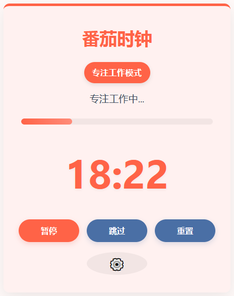
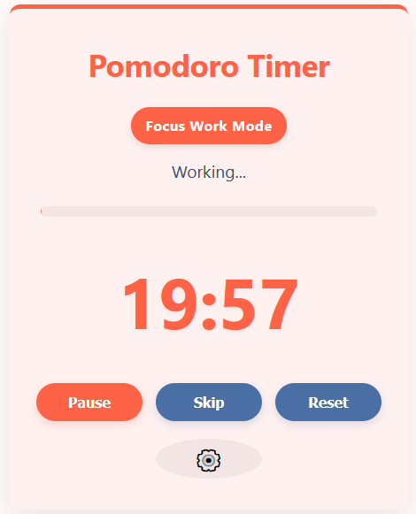

# 🍅 番茄时钟 / Pomodoro Timer

**在线体验 / Try it online:** [https://fanqie.kiki.one/](https://fanqie.kiki.one/)

[English](#-pomodoro-timer) | [中文](#-番茄时钟)

## 🍅 番茄时钟

一个基于Cloudflare Workers的轻量级番茄工作法计时器应用，支持中英文界面，专为提高工作效率和时间管理而设计。本应用位于仓库的 `pomodoro` 目录中。

### 📸 应用截图

<div align="center">
  
</div>

### ✨ 功能特点

- 🔄 **工作与休息模式自动切换**：完成工作时段后自动切换至休息时段
- 🌐 **中英文双语支持**：自动检测浏览器语言并支持手动切换
- 🔔 **桌面通知**：时段结束时发送通知提醒（需要授权）
- 💾 **状态持久化**：即使浏览器刷新或关闭后重启，也能保持计时状态
- 📱 **响应式设计**：完美适配桌面和移动设备
- 🎨 **主题变化**：工作和休息模式拥有不同的视觉主题
- ⚙️ **自定义设置**：可调整工作和休息的时长
- 📊 **进度显示**：直观的进度条展示当前阶段完成情况
- 📑 **标题更新**：浏览器标签页标题会显示当前计时状态

### 🚀 如何使用

#### 在线使用

直接访问已部署的版本：[番茄时钟应用](https://fanqie.kiki.one/)

#### 本地开发

1. **克隆仓库**

```bash
git clone https://github.com/zgx/cf-workers.git
cd cf-workers/pomodoro
```

2. **安装依赖**

```bash
npm install
```

3. **本地运行**

```bash
npm run dev
```

4. **部署到Cloudflare Workers**

```bash
npm run deploy
```

### 📖 使用指南

1. **开始工作**：点击"开始"按钮，开始专注工作时段
2. **暂停/继续**：需要临时暂停时，点击"暂停"按钮；准备继续时，点击"继续"
3. **跳过**：想直接进入下一个阶段时，点击"跳过"按钮
4. **重置**：需要重新开始时，点击"重置"按钮
5. **设置**：点击齿轮图标，可以调整工作和休息时间
6. **语言切换**：点击右上角的语言按钮切换中英文界面
7. **通知权限**：首次使用时，建议授权通知权限，以便在计时结束时收到提醒

### 🔧 番茄工作法简介

番茄工作法（Pomodoro Technique）是一种时间管理方法，使用一个计时器来分割工作为25分钟一节，中间用短暂的休息时间隔开。步骤如下：

1. 确定待完成的任务
2. 设置番茄钟为25分钟（可调整）
3. 专注工作直到时间结束
4. 休息5分钟（可调整）
5. 每完成四个番茄钟周期，休息一个较长时间（15-30分钟）

### 💻 技术栈

- Cloudflare Workers：无服务器运行环境
- 纯原生JavaScript：无需额外框架
- HTML5 & CSS3：构建响应式界面
- Web Notifications API：提供桌面通知
- localStorage API：实现状态持久化

---

## 🍅 Pomodoro Timer

A lightweight Pomodoro Technique timer application based on Cloudflare Workers, with English and Chinese interface support, designed to improve work efficiency and time management. This application is located in the `pomodoro` directory of the repository.

### 📸 Screenshots

<div align="center">
  
</div>

### ✨ Features

- 🔄 **Automatic Mode Switching**: Automatically switches between work and break modes
- 🌐 **Bilingual Support**: Automatically detects browser language and supports manual switching
- 🔔 **Desktop Notifications**: Sends notifications when a session ends (requires permission)
- 💾 **State Persistence**: Maintains timer state even after browser refresh or restart
- 📱 **Responsive Design**: Perfectly adapts to desktop and mobile devices
- 🎨 **Theme Variation**: Different visual themes for work and break modes
- ⚙️ **Custom Settings**: Adjustable work and break durations
- 📊 **Progress Display**: Intuitive progress bar showing current phase completion
- 📑 **Title Updates**: Browser tab title displays current timer status

### 🚀 How to Use

#### Online Usage

Access our deployed version directly: [Pomodoro Timer App](https://fanqie.kiki.one/)

#### Local Development

1. **Clone the Repository**

```bash
git clone https://github.com/zgx/cf-workers.git
cd cf-workers/pomodoro
```

2. **Install Dependencies**

```bash
npm install
```

3. **Run Locally**

```bash
npm run dev
```

4. **Deploy to Cloudflare Workers**

```bash
npm run deploy
```

### 📖 User Guide

1. **Start Working**: Click the "Start" button to begin a focused work session
2. **Pause/Resume**: Need a temporary break? Click "Pause"; Ready to continue? Click "Resume"
3. **Skip**: Want to move to the next phase? Click the "Skip" button
4. **Reset**: Need to start over? Click the "Reset" button
5. **Settings**: Click the gear icon to adjust work and break durations
6. **Language Switch**: Click the language button in the top right to switch between English and Chinese
7. **Notification Permission**: For first-time use, we recommend granting notification permissions to receive alerts when sessions end

### 🔧 The Pomodoro Technique

The Pomodoro Technique is a time management method that uses a timer to break work into intervals, traditionally 25 minutes in length, separated by short breaks. Here's how it works:

1. Decide on the task to be done
2. Set the Pomodoro timer for 25 minutes (adjustable)
3. Work on the task until the timer rings
4. Take a 5-minute break (adjustable)
5. After four Pomodoro cycles, take a longer break (15-30 minutes)

### 💻 Tech Stack

- Cloudflare Workers: Serverless runtime environment
- Pure Vanilla JavaScript: No additional frameworks needed
- HTML5 & CSS3: Responsive interface design
- Web Notifications API: Desktop notifications
- localStorage API: State persistence implementation

## 📝 License

MIT

## 🤝 Contributing

We welcome issue reports and feature suggestions! If you want to contribute code, please open an issue first to discuss what you would like to change.

---

💡 **Tip**: The key to the Pomodoro Technique is focused work periods and strictly enforced breaks. By using this tool, you can develop more focused and efficient work habits. 